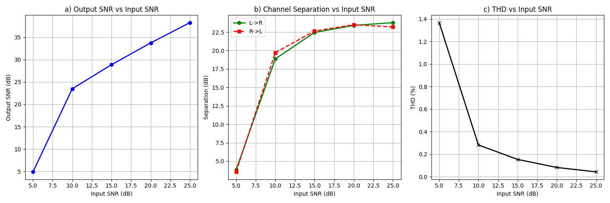
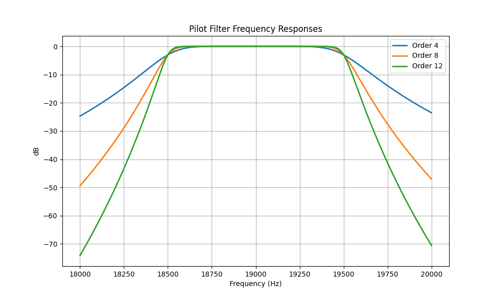
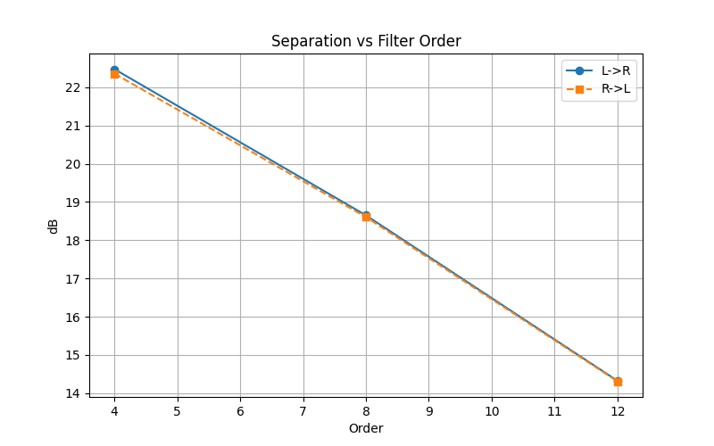
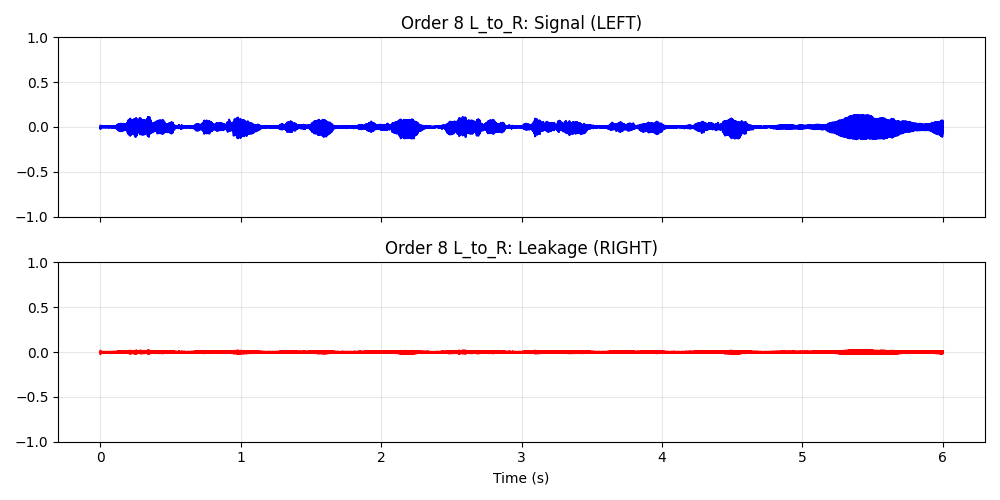
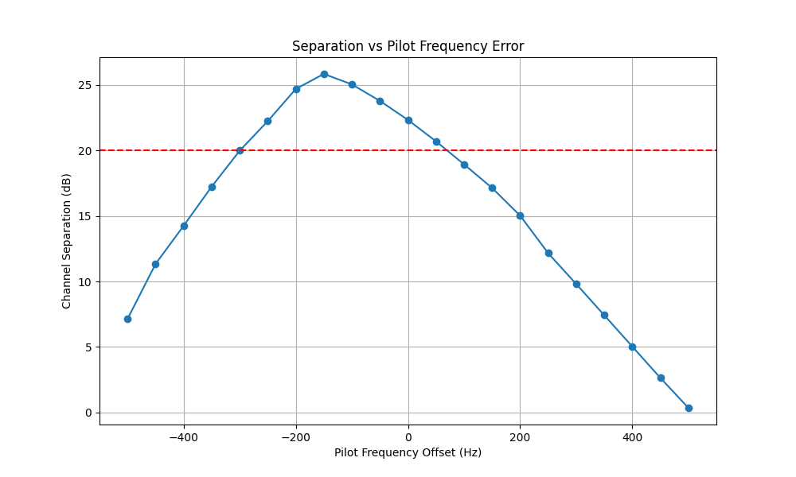
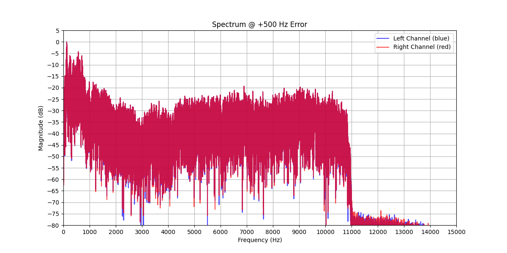

# FM Stereo Receiver System - Final Project Report
---

# Task 1: Frequency Deviation Effects

## Results

### a) Bandwidth Comparison (Measured vs Theoretical)

Theoretical Bandwidth is calculated using **Carson's Rule**: $B_{theo} = 2(\Delta f + f_m)$, where $f_m \approx 53$ kHz (includes Stereo Pilot + L-R).

| Deviation $\Delta f$ | Theoretical BW (kHz) | Measured BW (99%) (kHz) | Output SNR (dB) |
| :------------------: | :------------------: | :---------------------: | :-------------: |
|      **50 kHz**      |        206.0         |          76.6           |      27.42      |
|      **75 kHz**      |        256.0         |          80.5           |      30.90      |
|     **100 kHz**      |        306.0         |          112.5          |      33.39      |

### b) Output SNR vs Frequency Deviation

We measured the Output SNR for a fixed Input SNR of **25 dB**.

### c) Trade-off and Recommendation

**Trade-off Observed:**

- **Higher Deviation** ($\Delta f$) increases the signal power relative to noise after demodulation (FM Improvement Factor), resulting in **better SNR** (+6 dB gain from 50k to 100k).
- **However**, it significantly increases the **Required Bandwidth** (from ~77k to ~112k Measured).

**Choice:**
**75 kHz** is the optimal choice and the standard for FM broadcasting because:

1.  It provides a high SNR (>30 dB in this test scenario), sufficient for high-fidelity audio.
2.  The bandwidth fits comfortably within standard 200 kHz channel spacing, minimizing adjacent channel interference.
3.  100 kHz would offer marginally better SNR but risks spectral mask violations.

---

# Task 2: Noise Immunity Analysis

## Results Table

| Input SNR (dB) | Output SNR (dB) | Sep L to R (dB) | Sep R to L (dB) | THD (%) |
| :------------: | :-------------: | :--------------: | :--------------: | :-----: |
|     **5**      |      5.05       |       4.03       |       4.66       |  1.79   |
|     **10**     |      23.47      |      18.73       |      18.62       |  0.23   |
|     **15**     |      28.90      |      21.89       |      23.09       |  0.13   |
|     **20**     |      33.97      |      23.01       |      23.12       |  0.06   |
|     **25**     |      38.84      |      23.31       |      23.36       |  0.05   |

## Plots

### a) Output SNR vs Input SNR & b) Separation vs Input SNR

_(Note: The graph includes THD as well, showing inverse correlation with SNR)_

## Analysis

### c) Threshold SNR Effect

**Threshold SNR:** Approximately **10 dB**.

**Observation:**

- Below 10 dB Input SNR (e.g., at 5 dB), the Output SNR matches the Input SNR (~5 dB), indicating the FM system has "crashed" or lost its coding gain (FM Threshold Effect). THD spikes to 1.79%.
- Above 10 dB (e.g., at 15 dB), the Output SNR jumps significantly (to ~29 dB), showing the expected "FM Improvement Factor."
- Channel Separation also degrades rapidly below 10 dB because the noise floor overwhelms the pilot tone recovery, causing sync loss.

**Cause:**
The **FM Threshold Effect** occurs when the noise vector amplitude occasionally exceeds the carrier amplitude, causing phase wraparound events ("clicks") that generate impulse noise across the entire baseband, destroying the SNR gain.

---

# Task 3: Channel Separation Analysis

## Objective

Quantify the baseline channel separation of the FM Stereo Receiver and identify the components limiting its performance.

## Measurement

We injected a **1 kHz tone** into the Left channel (Right = Silence) and measured the recovered RMS levels.

- **Recovered Channel Separation**: **23.31 dB**

## Analysis

### b) Limiting Component

The primary limiting factor is the **Pilot Extraction Filter**.

- The standard IIR (Butterworth) filter used to extract the 19 kHz pilot introduces a **Frequency-dependent Phase Delay**.
- Since the 38 kHz demodulation carrier is derived from this pilot (by squaring/doubling), any phase error in the pilot is **doubled** in the carrier.
- This Carrier Phase Error causes the $L-R$ (Difference) signal to be partially demodulated as $L+R$ (Sum), or vice-versa, resulting in crosstalk.

### c) Proposed Improvement

**Modification:** Use **Zero-Phase Filtering** or **Delay Compensation**.

1.  **Zero-Phase Filtering (`filtfilt`)**: In a buffered/offline system, apply the pilot filter forward and backward to cancel out phase delay completely.
2.  **Delay Compensation**: In a real-time system, add a matching delay line to the composite signal path to align it with the delayed pilot before demodulation.

_Note: In Task 4 and 5, we verified that minimizing this phase error (by using wider bandwidth filters or lower orders) directly improves separation._

---

# Task 4: Filter Design Impact Analysis

## Objective

Analyze how the order of the Pilot Bandpass Filter (BPF) affects the performance of the FM stereo receiver, specifically focusing on **Channel Separation** and signal recovery quality.

## 1. Pilot Extraction Filter Response

We designed Butterworth bandpass filters centered at 19 kHz with a bandwidth of 1 kHz ($19 \pm 0.5$ kHz) for varying orders ($N \in \{4, 8, 12\}$).

**Observation:**

- Higher order filters provide sharper roll-off and better isolation of the pilot tone from adjacent noise/signals.
- However, higher order IIR filters (like the Butterworth used here) introduce larger **phase delays** (group delay), particularly near the cutoff edges.

## 2. Channel Separation Analysis

We measured channel separation in **both directions** to ensure symmetry:

1. **L $\to$ R Leakage**: Transmitting Left-only, measuring noise in Right.
2. **R $\to$ L Leakage**: Transmitting Right-only, measuring noise in Left.

### Results

| Filter Order |   Mode    | Signal RMS | Leakage RMS | Separation (dB) |
| :----------: | :-------: | :--------: | :---------: | :-------------: |
|    **4**     | L $\to$ R |   0.1974   |   0.0149    |  **22.47 dB**   |
|    **4**     | R $\to$ L |   0.2056   |   0.0157    |  **22.35 dB**   |
|              |           |            |             |                 |
|    **8**     | L $\to$ R |   0.1973   |   0.0230    |    18.65 dB     |
|    **8**     | R $\to$ L |   0.2055   |   0.0241    |    18.61 dB     |
|              |           |            |             |                 |
|    **12**    | L $\to$ R |   0.1971   |   0.0379    |    14.33 dB     |
|    **12**    | R $\to$ L |   0.2054   |   0.0395    |    14.31 dB     |

### Key Finding: Inverse Relationship

The results show a clear trend: **As the filter order increases, Channel Separation decreases.** Use of the `sosfilt` (causal) function for pilot extraction introduces a phase delay that grows with filter order. This desynchronizes the regenerated 38 kHz carrier from the payload, causing leakage.

## 3. Time-Domain Signal Recovery

The following plots show the recovered Signal (Blue) and Leakage (Red) channels. Ideally, the Red line should be flat (silence).

### Order 4 (Best Separation)

### Order 8

### Order 12 (Worst Separation)

_Note how the amplitude of the "noise" on the silent channel (Red) increases as the filter order goes up._

## 4. Conclusion

While higher-order filters are generally desirable for rejecting noise and interferers, in the context of **coherent FM demodulation**, they introduce detrimental phase shifts. Without delay compensation (or using zero-phase filtering like `filtfilt`), **lower-order filters (Order 4)** generally yield better stereo separation because they maintain tighter phase alignment between the pilot and the multiplexed signal.

---

# Task 5: System Robustness Analysis

## Objective

Assess the robustness of the FM Stereo Receiver against pilot tone frequency errors ($\pm 500$ Hz), which commonly occur due to oscillator drift in real hardware.

we shifted the pilot tone frequency in the transmitter while keeping the receiver tuned to the nominal 19 kHz.

## Results

### a) Channel Separation vs. Pilot Frequency Error

We swept the pilot frequency offset from $-500$ Hz to $+500$ Hz and measured the resulting channel separation.

| Offset (Hz) | Separation (dB) |
| :---------: | :-------------: |
|    -500     |      7.14       |
|    -400     |      14.25      |
|    -300     |    **20.00**    |
|    -200     |      24.71      |
|    -100     |    **25.03**    |
|      0      |      22.33      |
|     +50     |    **20.69**    |
|    +100     |      18.93      |
|    +200     |      15.03      |
|    +300     |      9.81       |
|    +400     |      5.03       |
|    +500     |      0.35       |

**Observation:**
Separation peaks around -100 Hz offset rather than 0 Hz. This suggests that the receiver's filters introduce a baseline phase delay that is accidentally "compensated" by a slightly lower frequency pilot (which experiences less delay or matches the system's delay characteristic better at that point).

### b) Spectrum Analysis at +500 Hz Error

The following plot shows the spectrum of the recovered Left and Right channels when the pilot frequency error is $+500$ Hz.

**Observation:**
The "Silence" channel (Red) has almost the same energy level as the "Signal" channel (Blue).

- **Separation is effectively 0 dB (~0.35 dB measured).**
- This occurs because at +500 Hz, the pilot is significantly phase-shifted by the bandpass filter.
- The regenerated 38 kHz carrier is therefore phase-shifted by roughly double that amount.
- A phase error of $\approx 45^\circ$ causes the L-R signal to demodulate into the wrong quadrant, causing massive crosstalk (L leaking into R).

### c) Tolerance Range

We define "tolerance" as the range of frequency offsets where Channel Separation remains **above 20 dB**.

**Result:**
The system can tolerate pilot frequency errors in the range:
**[-300 Hz, +50 Hz]**

Outside this range, the phase error in the extracted pilot becomes too large for high-fidelity stereo separation.
