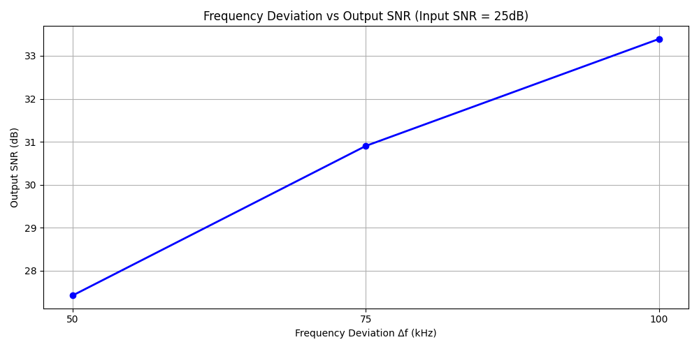

# Task 1: Frequency Deviation Effects

## Objective

Analyze the trade-off between Frequency Deviation $\Delta f$, Signal Bandwidth, and Output SNR. We tested three standard deviations: 50 kHz, 75 kHz (Standard), and 100 kHz.

## Results

### a) Bandwidth Comparison (Measured vs Theoretical)

Theoretical Bandwidth is calculated using **Carson's Rule**: $B_{theo} = 2(\Delta f + f_m)$, where $f_m \approx 53$ kHz (includes Stereo Pilot + L-R).

| Deviation $\Delta f$ | Theoretical BW (kHz) | Measured BW (99%) (kHz) | Output SNR (dB) |
| :------------------: | :------------------: | :---------------------: | :-------------: |
|      **50 kHz**      |        206.0         |          76.6           |      27.42      |
|      **75 kHz**      |        256.0         |          80.5           |      30.90      |
|     **100 kHz**      |        306.0         |          112.5          |      33.39      |

_Note: Measured bandwidth (99% power) is often lower than Carson's Rule because the spectral power density drops off rapidly for FM signals with modulation indices $\beta \approx 1-2$._

### b) Output SNR vs Frequency Deviation

We measured the Output SNR for a fixed Input SNR of **25 dB**.

### c) Trade-off and Recommendation

**Trade-off Observed:**

- **Higher Deviation** ($\Delta f$) increases the signal power relative to noise after demodulation (FM Improvement Factor), resulting in **better SNR** (+6 dB gain from 50k to 100k).
- **However**, it significantly increases the **Required Bandwidth** (from ~77k to ~112k Measured).

**Choice:**
**75 kHz** is the optimal choice and the standard for FM broadcasting because:

1.  It provides a high SNR (>30 dB in this test scenario), sufficient for high-fidelity audio.
2.  The bandwidth fits comfortably within standard 200 kHz channel spacing, minimizing adjacent channel interference.
3.  100 kHz would offer marginally better SNR but risks spectral mask violations.
