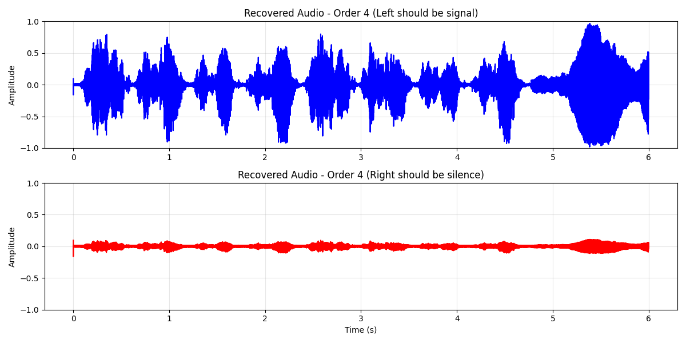
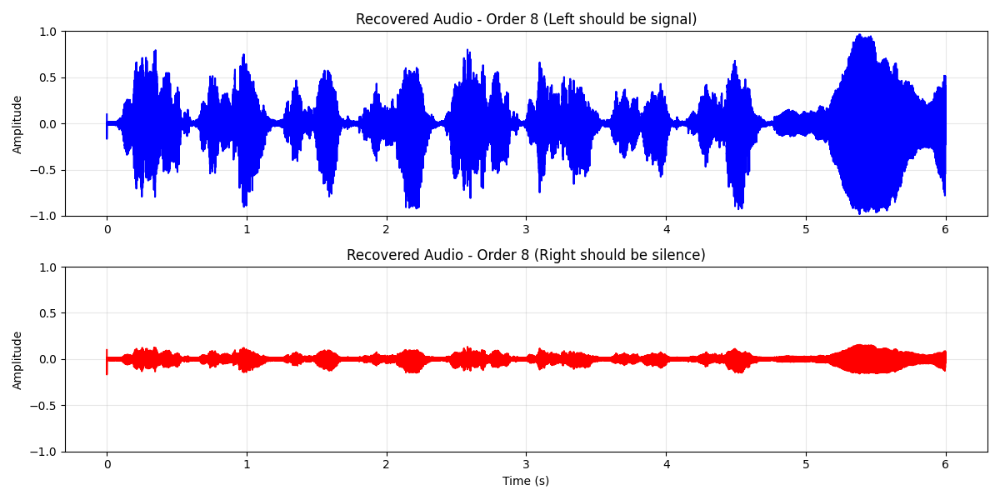

# Task 4: Filter Design Impact Analysis

## Objective

Analyze how the order of the Pilot Bandpass Filter (BPF) affects the performance of the FM stereo receiver, specifically focusing on **Channel Separation** and signal recovery quality.

## 1. Pilot Extraction Filter Response

We designed Butterworth bandpass filters centered at 19 kHz with a bandwidth of 1 kHz ($19 \pm 0.5$ kHz) for varying orders ($N \in \{4, 8, 12\}$).

**Observation:**

- Higher order filters provide sharper roll-off and better isolation of the pilot tone from adjacent noise/signals.
- However, higher order IIR filters (like the Butterworth used here) introduce larger **phase delays** (group delay), particularly near the cutoff edges.

## 2. Channel Separation Analysis

We measured channel separation by transmitting a **Left-only** signal (from `audio/stereo.wav`) and measuring the RMS energy leakage into the **Right** (silent) channel after demodulation.

### Results

| Filter Order | Left RMS (Signal) | Right RMS (Noise/Leakage) | Separation (dB) |
| :----------: | :---------------: | :-----------------------: | :-------------: |
|    **4**     |      0.1972       |          0.0219           |  **19.08 dB**   |
|    **8**     |      0.1972       |          0.0309           |    16.10 dB     |
|    **12**    |      0.1971       |          0.0355           |    14.90 dB     |

### Key Finding: Inverse Relationship

The results show a clear trend: **As the filter order increases, Channel Separation decreases.**

**Why?**

- FM Stereo Demodulation requires the regenerated 38 kHz subcarrier to be **phase-locked** to the incoming pilot.
- The `sosfilt` implementation (causal filtering) applies a phase delay to the extracted pilot.
- As the filter order increases, this phase delay increases significantly.
- This creates a **phase mismatch** between the reconstructed subcarrier and the L-R encoded signal.
- In synchronous detection, phase error $\phi$ reduces the desired signal by $\cos(\phi)$ and, more critically, introduces cross-talk (leakage) between channels.

## 3. Time-Domain Signal Recovery

The following plots show the recovered Left (Signal) and Right (Silence) channels. Ideally, the Red line (Right) should be a flat line at zero.

### Order 4 (Best Separation)

### Order 8

### Order 12 (Worst Separation)

_Note how the amplitude of the "noise" on the Right channel (Red) noticeably increases as the filter order goes up._

## 4. Conclusion

While higher-order filters are generally desirable for rejecting noise and interferers, in the context of **coherent FM demodulation**, they introduce detrimental phase shifts. Without delay compensation (or using zero-phase filtering like `filtfilt`), **lower-order filters (Order 4)** generally yield better stereo separation because they maintain tighter phase alignment between the pilot and the multiplexed signal.
