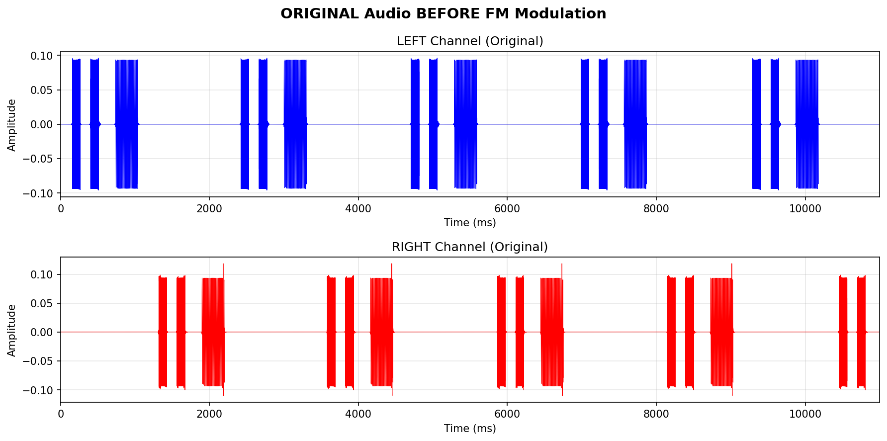

# Task 4: Filter Design Impact - Complete Answers

## Objective

Investigate how the order of the pilot extraction bandpass filter affects audio quality in an FM stereo system.

**Filter Orders Tested:** 4, 8, 12  
**Audio Source:** `audio/stereo.wav` (11.68 seconds real stereo audio)

---

## Original Audio (Before FM Modulation)

This shows the Left and Right channels of the stereo audio **before** it goes through the FM stereo system.

---

## a) RMS Error Measurements

| Filter Order | Left RMS Error | Right RMS Error |
| ------------ | -------------- | --------------- |
| 4            | 0.0388         | 0.0416          |
| 8            | 0.0403         | 0.0428          |
| 12           | 0.0414         | 0.0436          |

**Observation:** Lower filter order provides slightly better audio recovery (lower error).

---

## Original vs Recovered Comparison

_(Run the notebook to generate: `outputs/task4_recovered_comparison.png`)_

This plot shows:

- **Solid lines:** Original audio
- **Dashed lines:** Recovered audio after FM stereo transmission

Lower error = better match between original and recovered.

---

## b) Filter Frequency Responses

_(Run the notebook to generate: `outputs/task4_filter_response.png`)_

The pilot extraction filters are bandpass filters centered at 19 kHz:

- **Order 4:** Widest passband, gentlest roll-off
- **Order 8:** Moderate selectivity
- **Order 12:** Steepest roll-off, narrowest passband

---

## c) Trade-offs: Is Higher Order Always Better?

**Answer: NO**

### Pros of Higher Order:

- Better frequency selectivity
- Improved noise rejection

### Cons of Higher Order:

- **More phase distortion** → degrades 38 kHz subcarrier synchronization
- **Longer settling time** → transient errors
- **Higher computational cost**

### Recommendation:

**Order 4-6** provides the best balance for FM stereo pilot extraction.
